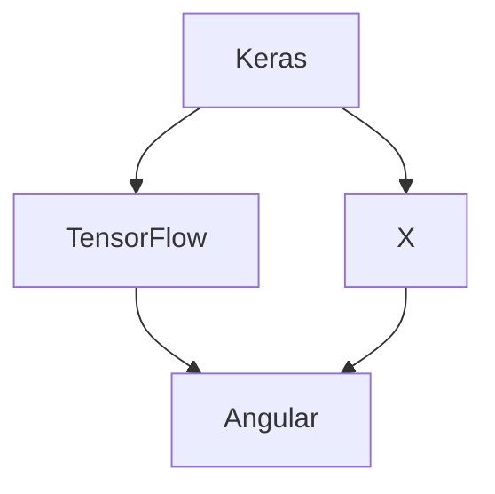

# Workflow



<br>

## Tasks

* [AngularJS App](http://localhost:4200/)
* npm install [tensorflow/tfjs](https://www.tensorflow.org/js/tutorials/setup#installation_from_npm)
* import ng-tfjs
* build ML model
* create prediction
* set Anaconda
* pip install [tensorflowjs](https://pypi.org/project/tensorflowjs/)
* convert Keras model


<br>
<br>


## Installation  ⌇  <sup>*WIP*</sup>

### 01 ⋯ Tensorflow in AngularJS <sup>᠄ [01](#r01)</sup>

---

Generate Angular App
```
$ npm install -g @angular/cli
$ ng new TensorFlowApp
```

Install TensorFlowJS
```
$ cd TensorFlowApp
$ npm install @tensorflow/tfjs --save
```
<!-- - update dependencies if needed -->

<br>
<br>


### 02 ⋯ Anaconda <sup>᠄ [02](#r02)</sup>

---

```
$ conda create -n my_environment_name python=3.6 
```
```
$ conda activate my_environment_name
$ conda deactivate
```

<br>
<br>


### 03 ⋯ Create Keras Model in TensorFlow.js

---


 ```
$ pip install tensorflowjs
 ```
 [Convert](https://www.tensorflow.org/js/tutorials/conversion/import_keras) existing Keras model to TensorFlow.js
 ```
 $ tensorflowjs_converter \
 > --input_format keras \
 > keras/cnn.h5 \
 > src/assets
 ```
<br>

#### Errors

If ` pip install tensorflowjs ` returns  `tf-nightly`

```
$ pip install tf-nightly-2.0-preview
```
<br>

And if `tf-nightly-2.0-preview failed to install` returns
Download compatible `.whl` file at [https://pypi.org/project/tf-nightly/#files](https://pypi.org/project/tf-nightly/#files)
```
$ pip install <path/to/package>.whl
```

Example
```
$ pip install /Users/user/whl/tf_nightly_2.0_preview-2.0.0.dev20190327-cp36-cp36m-macosx_10_9_x86_64.whl
```

<br>
<br>

## Resources

### Footnotes

---

* <a name="r01">01</a> ⋯ [Can't load @tensorflow/tfjs in angularjs app](https://stackoverflow.com/questions/50026629/cant-load-tensorflow-tfjs-in-angularjs-app)
* <a name="r02">02</a> ⋯ [Pip is not installing TensorFlow Nightly Mac](https://stackoverflow.com/questions/53926348/pip-is-not-installing-tensorflow-nightly-mac)


<!-- <a name=""></a> ⋯ []()
<a name=""></a> ⋯ []() -->

<br>
<br>

### Keywords

---

- [ ] ecg data
- [ ] heart contraction
- [ ] adrenaline 
- [ ] sentimental analysis