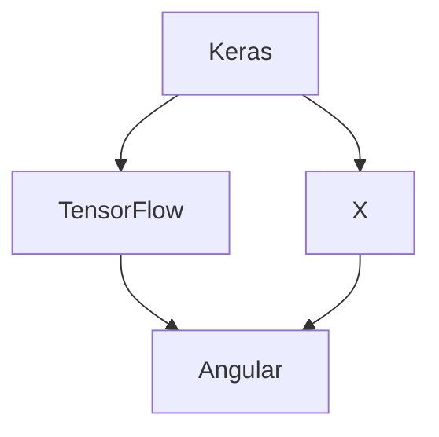

# Workflow



<br>

## Tasks

* [AngularJS App](http://localhost:4200/)
* install @tensorflow/tfjs (npm)
* import ng-tfjs
* build ML model
* create prediction
* set Anaconda
* install tensorflowjs (pip)
* convert Keras model


<br>
<br>


### Tensorflow in AngularJS <sup>᠄ [01](#r01)</sup>

---

Generate Angular App
```
$ npm install -g @angular/cli
$ ng new TFApp
```

Install TensorFlowJS
```
$ cd TFApp
$ npm install @tensorflow/tfjs --save
```
<!-- - update dependencies if needed -->

<br>
<br>

### Create Keras Model in TensorFlow.js

---


 ```
$ pip install tensorflowjs
 ```

﹊

If ` pip install tensorflowjs ` returns  `tf-nightly` error

```
$ pip install tf-nightly-2.0-preview
```
﹊

If `tf-nightly-2.0-preview failed to install`
Download compatible `.whl` file at [https://pypi.org/project/tf-nightly/#files](https://pypi.org/project/tf-nightly/#files)
```
$ pip install <path/to/package>.whl
```

Example
```
$ pip install /Users/user/whl/tf_nightly_2.0_preview-2.0.0.dev20190327-cp36-cp36m-macosx_10_9_x86_64.whl
```

<br>
<br>

### Anaconda <sup>᠄ [02](#r02)</sup>

---

```
$ conda create -n my_environment_name python=3.6 
```
```
$ conda activate my_environment_name
$ conda deactivate
```

<br>
<br>

### Resources

---

* <a name="r01">01</a> ⋯ [Can't load @tensorflow/tfjs in angularjs app](https://stackoverflow.com/questions/50026629/cant-load-tensorflow-tfjs-in-angularjs-app)
* <a name="r02">02</a> ⋯ [Pip is not installing TensorFlow Nightly Mac](https://stackoverflow.com/questions/53926348/pip-is-not-installing-tensorflow-nightly-mac)


<!-- <a name=""></a> ⋯ []()
<a name=""></a> ⋯ []() -->

<br>
<br>

### Keywords

---

- [ ] ecg data
- [ ] heart contraction
- [ ] adrenaline 
- [ ] sentimental analysis